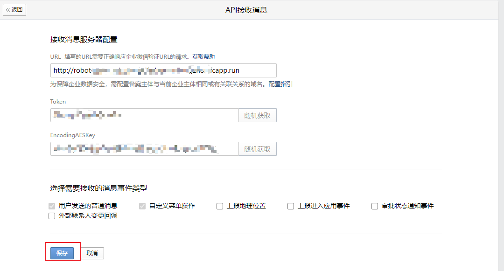
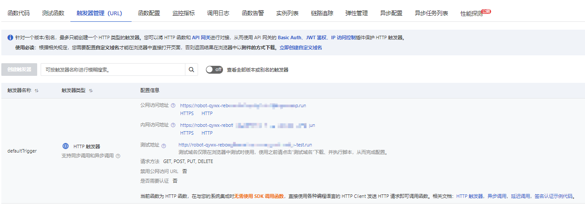

# chatgpt-wechat

微信用户可自建的 ChatGPT 机器人

## 效果如图


## 如何使用本项目代码？

### 1. 创建个人企业微信 并获取到对应的 企业id(corp_id)

访问 [管理员页面](https://work.weixin.qq.com/wework_admin/frame#profile) ,
可在 我的企业 > 企业信息 > 底部 看到  企业ID

### 1. 创建一个企业微信内部应用，并获取到 AgentId 和 Secret

可在 我的企业 > 应用管理 > 自建  看到创建应用，创建一个名为 **ChatGPT** 的应用，并上传应用头像。创建完成后可以在应用详情页看到到 AgentId 和 Secret


### 2. 点击启用消息

会进入验证步骤, 先不验证 url 我们可以 拿到  Token 跟 EncodingAESKey


### 3. 访问 [阿里云函数计算 fc ](https://fcnext.console.aliyun.com/cn-hangzhou/services) ，创建一个新的项目

登录 [阿里云函数计算 fc](https://fcnext.console.aliyun.com/cn-hangzhou/services) ，创建一个新的 Node.js v16 的服务，服务名可以根据你的需要填写，可以填写 ChatGPT .


再创建一个函数，函数名也可以随意


### 4. 复制本项目下的 aliyunfc/index.js 的源码内容，并粘贴到 webide 当中

然后点击顶部的 deploy ，完成第一次部署。


### 5. 安装所需依赖

这个开发过程中，我们使用了企业微信开放平台官方提供的 SDK，以及 axios 来完成调用。在webide中开启终端，安装 `axios` 和 `@wecom/crypto` 还有 `xmlreader`。

```shell
npm i axios
npm i @wecom/crypto
npm i xmlreader
```


安装完成后，点击上方的部署，使其生效。

### 6. 配置环境变量

接下来我们回到函数管理来配置环境变量，你需要配置两个个环境变量 `aes_key` 和 `aes_token` `aes_key` 填写你第二步获取到的 EncodingAESKey，`aes_token` 填写你第二步获取到的 Token。


配置完成，点确认后，再次点击上方的 **Deploy** 按钮部署，使这些环境变量生效。这个时候去 企业微信里面，

填入函数的 url , 点击保存, 验证就通过了.


url 可以通过函数的触发器管理页面获取~


### 7. 获取 OpenAI 的 KEY ，并配置环境变量

访问 [Account API Keys - OpenAI API](https://platform.openai.com/account/api-keys) ，点击 `Create new secret key` ，创建一个新的 key ，并保存备用。


### 8. 在自购服务器上 部署 golang 服务，并开启端口 这个时候我们就拿到了 req_host

- 这部分，新的后端框架刚刚上手，写的比较丑😓，稍微优化后，周末会发到仓库 `chat/` 目录下

### 9. 正式布发布与微信打通

可在 我的企业 > 微信插件 > 下方找到 一个邀请关注二维码，


微信扫码后，就可以在 微信中看到对应的公司名称，点进企业号应用，我们的机器人，赫然在列。

上述这些都配置完成后，你的机器人就配置好了

如果对您有帮助，也可以扫码我的公众号，感谢关注！


## FAQ

## 版本更新记录

### v0.1

- add 支持记忆多轮对话与记忆清理
- fix 对非文本格式数据进行回复拒绝

为了支持多轮对话，新增菜单配置  企业微信>应用管理>自定义菜单

效果如下


### v0.2

- 后端代码已发布
  - 需要 docker 以及简单的运维操作，实现已经卸载
  - 如需使用，请先配置相关数据库与 redis , 各类 密钥 通过 `chat\service\chat\api\etc\chat-api.yaml` 进行配置
  - over😀
- 增加 阿里云新增 req_token 环境变量来进行验证 请求合法性
