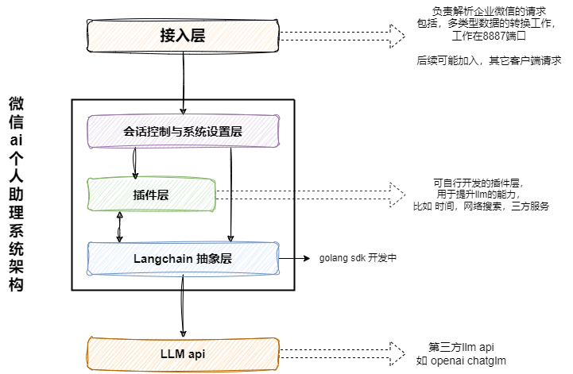

# chatgpt-wechat

可在微信 **安全使用（通过企业微信中转到微信，无封号风险）** 的 ChatGPT 个人助手应用,

> 本项目开源免费，不开知识星球，没有付费环节，除了最后给我自己的公众号【积木成楼】打了广告，
> 未在 GitHub 以外的地方进行引流操作。请谨记，要求你付费的都是骗子！

## 升级指引(v1.0.0 目前还处开发期,稳定版本使用 v0.6.6)
- 原始功能基本不受影响，但数据库切换到 `pgsql` 方便 向量化查询
- 支持了 Google 的 Gemini-pro 每个 token 60/m 的调用还是很香
- 支持了 web bot 设置，同时支持将 bot 发布到客服
- web 项目地址 [https://github.com/whyiyhw/agent-web](https://github.com/whyiyhw/agent-web) 前端苦手，全靠 Gemini 配合写的页面
- 支持了最新的企业微信客服协议
- 项目小助手，有问题可以先问它哦 ➡️➡️➡️ 

## 主要能力（[点击查看详情](./doc/ability.md)）

- 微信可用：基于企业微信中转，可在微信中安全使用
- 客服消息：[支持多渠道客服消息接入](./doc/custom_support_service.md)
- 代理支持： `http/sock5` 代理 && 反向域名代理支持, 除了 `openai` 也兼容了 `azure-openai`
- 余额查询： `openai` 余额查询
- 会话：
  - 场景模式：支持动态修改 `prompt`，预定义了上百种 `prompt` 角色模板
  - 连续对话：自适应的上下文设计，让 LLM 🧠拥有更长时间的短期记忆，避免手动清理上下文
  - 会话切换：多会话支持，可切换聊天场景,不丢失对话内容,可导出会话
  - 极速响应：支持基于流式接口的分段消息响应
- 消息：
  - 语音消息：支持多国语音消息，以及多语言文本输入
  - 图片消息：支持图片消息（答题场景）
- 绘画：
  - 支持`stable diffusion 1.5`作图
  - 支持 `openai` 作图
- 私有数据：`milvus` 私有化向量知识库支持
- 插件机制：[支持插件，点击查看](./doc/plugin.md)
  - 目前已支持 `shell`、`search`、`wikipedia`
  - 各位也可按照规则自行开发接入其他能力（summary, 天气 ...）

## 完整安装步骤（[点击查看详情](./doc/install.md)）

### 配置项详解（[点击查看详情](./doc/config.md)）

### 进阶玩法

- [企业微信客服](./doc/custom_support_service.md)
- [插件的使用](./doc/plugin.md)
- [图片生成-stable-diffusion](./doc/draw.md)
- [远程调用本地服务](./doc/frp.md)

## 项目架构设计（点击查看）

## 版本更新日志 [点击查看详情](./doc/CHANGELOG.md)

<details>
<summary>已实现</summary>

- [x] 单服务-多应用支持 2023-03-05
- [x] 新增代理设置      2023-03-05
- [x] 支持最新的 gpt3.5 与模型可自行切换
- [x] 支持 prompt 自定义配置
- [x] 命令式动态调整对话参数
- [x] 系统设置&预定义模板 2023-03-17
- [x] 支持服务端直接对接企业微信，无需云函数中转 2023-03-18
- [x] 支持多渠道客服消息 2023-04-02
- [x] 支持中英文语音输入 2023-04-07
- [x] 支持分段极速响应 2023-04-08
- [x] 支持向量引擎查询，基于语料的上下文与智能推荐 2023-04-08
- [x] 独立的上下文环境，可任意切换聊天场景 2023-04-09
- [x] 自适应的上下文长度，不用再频繁手动清理上下文环境 2023-04-09
- [x] 基础插件功能 2023-04-15
- [x] 支持 stable diffusion 1.5作图 [服务配置](https://help.aliyun.com/practice_detail/611227) 2023-04-25
- [x] 加入搜索插件 2023-04-27
- [x] 支持 openai key 余额查询 2023-05-15
- [x] 支持 openai 作图 2023-05-27
</details>

---

<details>
<summary> feature 版本，考虑与执行中</summary>

- [ ] 消息超长时如何处理？
- [ ] 自适应上下文，需要加入省流模式
- [ ] 作图支持 midjourney  api
- [ ] web 管理端
- [ ] web 客户端&用户体系改版
- [ ] 功能演示视频
- [ ] 可选
  - [ ] 阿里云 5000 小时免费额度白嫖计划
  - [ ] 同声转译 so-vits-svc 支持 
  - [ ] 支持 openapi 对话 token 累计功能， 余额不足时，支持 token 更换（可选）
  - [ ] 支持私有化知识库插件（可选）
  - [ ] 支持特定角色对话-如雅思口语练习（可选）
  - [ ] 支持web管理页面，配置入库方便修改（可选）
  - [ ] 支持 多 key 轮询，应对 openai 的限流机制（可选）
  - [ ] 长期记忆插件（规划中）
- [ ] 十分期待您的需求，可以提issue...
</details>

## FQA

### 配置完成，发送给 openai 的消息有响应，但是应用没有收到回复？
<details>
<summary></summary>

- 请确认 [5. 配置企业可信IP](./doc/install.md#5-配置企业可信ip) ，已配置
- 如果还是没有响应，请通过 `docker logs -f chat_web_1` 进行查看，
  - 应用消息的 关键字为 `应用消息-发送失败 err:` 
  - 客服消息的 关键字为 `客服消息-发送失败 err:`
- 如果存在 `Code 41001， Msg: "access token mising` ... 等 access_token 异常的,请再次确认
安装流程中的对应参数`CorpID ,agentSercret ,agentID` 是否正确配置
</details>

### 服务器在国内，出现 `connect: connection refused`
<details>
<summary></summary>

- 方法一 ： 请自行 安装 `proxy client` 然后开启 监听 0.0.0.0:socket 模式 ，不要开启认证，之后在配置文件中，开启配置就OK,详情请见 `v0.2.2` 
- 方法二 ： 把服务器移到 香港/海外 , 大陆地区将长期不能访问
</details>

### 修改 `chat-api.yaml` 配置后如何让其生效
<details>
<summary></summary>

- 你可以通过 `docker-compose restart web` 重启 web 服务
- 或者 `docker-compose build && docker-compose up -d` 重启整个服务
</details>

### 如何修改 redis 密码? 
<details>
<summary></summary>

- 首先修改 `chat/service/chat/api/etc/chat-api.yaml` 
```yaml
RedisCache:
    Pass: "xxxxxx"
```
- 再修改 `chat/build/redis/redis.conf`
```ini
requirepass "xxxxx"
```
- 最后 `docker-compose down && docker-compose up -d` 重启整个服务
</details>

### 更新后 redis 服务启动失败或者连不上redis？
<details>
<summary></summary>

> 请考虑删除 `chat/build/redis/data/` 下的文件，可能是因为旧版本的 redis 存在残留文件导致的

- 请先 `docker-compose down` 停止服务
- 然后 删除redis 本地文件 `chat/build/redis/data/` 下的文件
- 最后 `docker-compose up -d` 重启服务

</details>

## 感谢以下朋友对于本项目的大力支持~
  <p align="center">
    <a href="https://github.com/whyiyhw/chatgpt-wechat" target="_blank" rel="noopener noreferrer">
        
        
        
    </a>
    <a href="https://www.chaotiinfo.cn" target="_blank" rel="noopener noreferrer">
        
    </a>
  </p>
