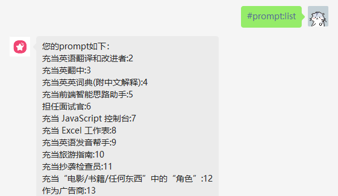
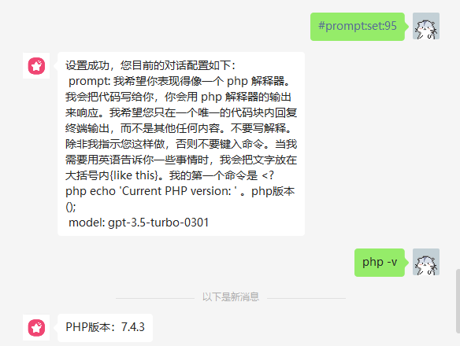
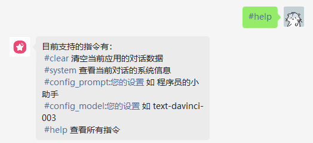
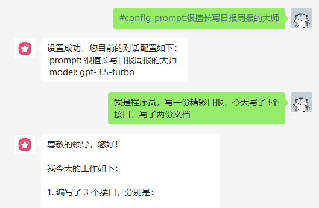
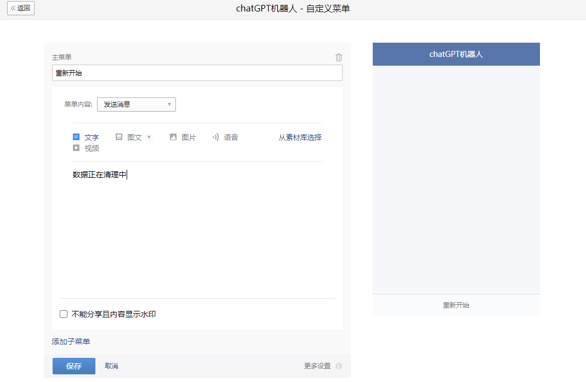
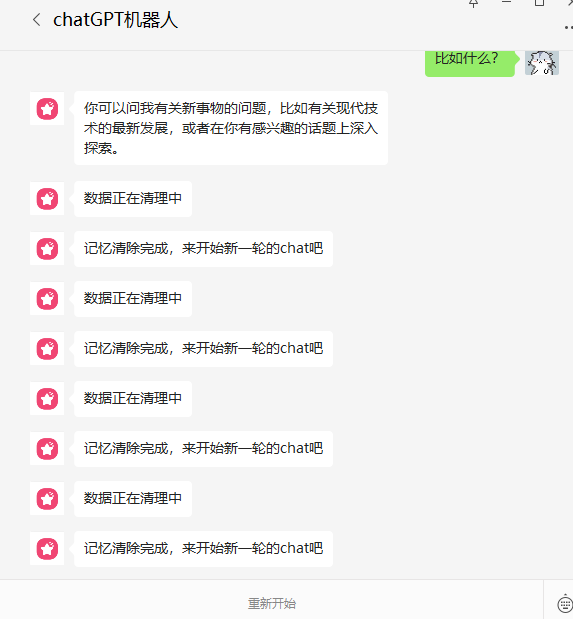

### v0.5
#### 新增多渠道客服消息,支持自定义端口

- 相关配置
```yaml
WeCom:                                              # 企业微信配置
  Port:                                             # 企业微信回调监听端口（可选）默认为8887
  CustomerServiceSecret: "xxxx-xxxx-xxxx"           # 企业微信客服消息 Secret
  Token: "xxxxxxxxxx"                               # 企业微信应用/客服消息 Token
  EncodingAESKey: "xxxxxxxxxxxxxxxx"                # 企业微信应用/客服消息 EncodingAESKey
```

### v0.4
#### 新增8887端口，支持服务器ip直接对接企业微信

#### 新增OCR支持，可用于答题相关场景
- [点击查看示例](./image25.jpg)
- 相关配置
```yaml
OCR:                                                # OCR配置 ,开启图片识别（可选）
  Company: "ali"                                    # 识别公司，目前支持阿里云（可选）
  AliYun:                                           # 阿里云配置
    AccessKeyId: ""                                 # 阿里云 key
    AccessKeySecret: ""                             # 阿里云 secret
```
#### 新增预定义模板指令 `#prompt:list`

#### 新增预定义模板选择 `#prompt:set:{id}`


#### changelog 升级说明
- 从低版本，已部署系统升级上来的需要清理数据库信息才能重新 构建
- 如 在 chat 目录下执行 去清理数据
```shell
sudo docker-compose down
sudo rm -rf ./build/mysql/data/*
sudo rm -rf ./build/redis/data/*
sudo docker-compose build 
sudo docker-compose up -d
```
#### fix
- 数据库对于中文字符乱码问题
- 微信端发送文字长度限制问题
- 优化了上下文过长时的错误提示文案

### v0.3.1
- 新增 WeCom.Welcome 自定义15天欢迎语
- 新增 反向代理支持（可选）,将 OpenAi.Host 换成 对应的反向代理域名即可

```shell
WeCom:
  Welcome: "您好！我是 ChatGPT，一个由 OpenAI 训练的大型语言模型，我可以回答您的问题和进行交流。请告诉我您需要了解些什么，我会尽力为您提供答案。发送#help 查看更多功能"

OpenAi:
  Key: "xxxxxxxxxxxxxxxxxxxxx"
  Host: "https://api.openai.com"
```
### v0.3
- 新增最新版本的 gpt3.5 api 配置 与 prompt 自定义配置
```
WeCom:
  BasePrompt: "你是 ChatGPT, 一个由 OpenAI 训练的大型语言模型, 你旨在回答并解决人们的任何问题，并且可以使用多种语言与人交流。"
  Model: "text-davinci-003"
  MultipleApplication:
  - AgentID: 1000002
    AgentSecret: "55sO-xxxxxxxxxxxxxxxxxxxxxxx"
    Model: "gpt-3.5-turbo"
    BasePrompt: "你是 ChatGPT, 一个由 OpenAI 训练的大型语言模型, 你旨在回答并解决人们的任何问题，并且可以使用多种语言与人交流。"
```
- 新增 指令对话模式



- 新增 通过 指令对话模式 实时更换 角色与 model
  

#### changelog 升级说明
- 从低版本，已部署系统升级上来的需要清理数据库信息才能重新 构建
- 如 在 chat 目录下执行 去清理数据
```shell
sudo docker-compose down
sudo rm -rf ./build/mysql/data/*
sudo rm -rf ./build/redis/data/*
sudo docker-compose build 
sudo docker-compose up -d
```

### v0.2.2
- 新增多应用支持(可选), 如果你有多个应用只开了一个服务，现在你可以开启多应用配置，相关参数就在企业微信应用详情页
```
  MultipleApplication:
  - AgentID: 1000002
    AgentSecret: "55sO-xxxxxxxxxxxxxxxxxxxxxxx"
  - AgentID: 1000003
    AgentSecret: "lwAFxxxxxxxxxxxxxxxxxxxxxxxxxxxxx"
```
- 因为 服务器在国内，新增代理设置来保证服务可用, 暂时只支持socket5（可选）
```
Proxy:
  Enable: false
  Socket5: "127.0.0.1:1080"
```

### v0.2.1
- 简化后端运维操作，增加 docker-compose 来编排服务

### v0.2

- 后端代码已发布
  - 需要 docker 以及简单的运维操作，实现已经卸载
  - 如需使用，请先配置相关数据库与 redis , 各类 密钥 通过 `chat\service\chat\api\etc\chat-api.yaml` 进行配置
  - over😀
- 增加 阿里云新增 req_token 环境变量来进行验证 请求合法性

### v0.1

- add 支持记忆多轮对话与记忆清理
- fix 对非文本格式数据进行回复拒绝

为了支持多轮对话，新增菜单配置  企业微信>应用管理>自定义菜单

效果如下
