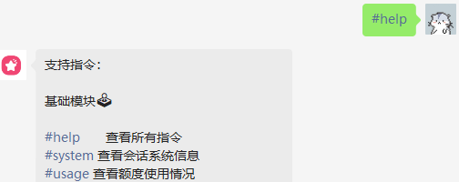
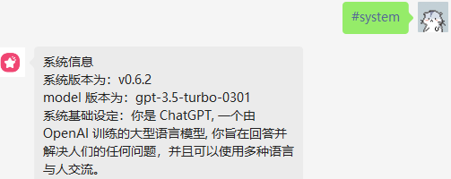
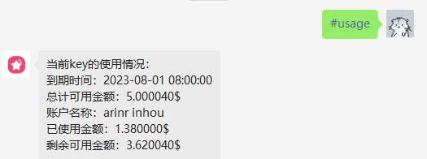
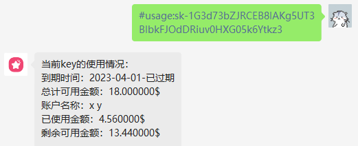
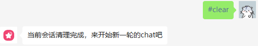
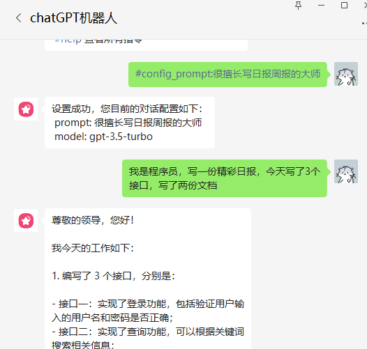
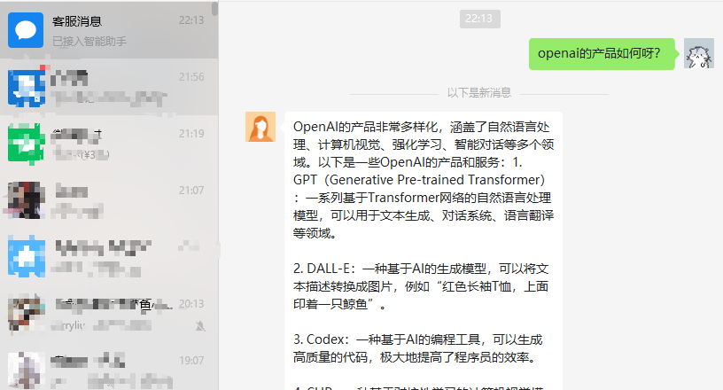

## 项目主要设置以命令式 # 开头，以注释形式说明
```txt
支持指令：

基础模块🕹️
#help   查看所有指令
#system 查看会话系统信息
#usage  查看额度使用情况
#usage:sk-xxx 查看指定 key 的使用情况
#clear 清空当前会话的上下文数据

会话设置🦄
#config_prompt:xxx，如程序员的小助手
#config_model:xxx，如text-davinci-003
#config_clear 初始化对话设置
#prompt:list 查看所有支持的预定义角色
#prompt:set:xx 如 24(诗人)，角色应用

会话控制
#session:start 开启新的会话
#session:list  查看所有会话
#session:clear 清空所有会话
#session:exchange:xxx 切换指定会话

绘图
#draw:xxx 按照指定 prompt 进行绘画
```
## 基础模块
### `#help` 获取所有可用参数

### `#system` 获取当前对话系统信息的基本信息，可用于判定配置是否正确加载 

### `#usage` 获取当前默认 key 的额度使用情况

- //TODO 其它待完善（每日账单、账单发送到邮箱/本地、每个用户使用情况...）
### `#usage:sk-xxx` 查看指定 key 的使用情况

- 在应用消息中 发送 `#usage:sk-P8OUnFOUJ8xxxxxxxxxxxxxh1b6sEQgbru1` 查询其它 key 的使用额度
### `#clear` 清空当前会话的上下文数据

- 因为默认会加载上下文，之前的话题可能会影响到当前的对话，这个时候可以通过 `#clear` 清空上下文，重新开始对话
- 也可以通过 `#session:start` 开启新的会话，这样就能保证上下文的干净
- 对于部分异常情况，也可以通过 `#clear` 清空上下文，重新开始对话

## 会话设置
### 主要能力会话（支持自适应的上下文）

- 第一个为自定义 prompt
  <p align="center">
    <a href="https://github.com/whyiyhw/chatgpt-wechat" target="_blank" rel="noopener noreferrer">
        
    </a>
  </p>
- 第二个为预定义 prompt
  <p align="center">
    <a href="https://github.com/whyiyhw/chatgpt-wechat" target="_blank" rel="noopener noreferrer">
        
        
    </a>
  </p>
- 可选能力
    - （视频号/公众号/小程序/微信/企微/app/web）[支持多渠道客服消息接入](./custom_support_service.md)
        - **通过链接即可在微信中共享企微的 chatgpt 能力，再也不用强制要求加入企业才能使用**
      <p align="center">
      <a href="https://github.com/whyiyhw/chatgpt-wechat" target="_blank" rel="noopener noreferrer">
          
      </a>
  </p>

    - （图片识别-小猿搜题 青春版）
        - [点击查看示例](./image25.jpg)


