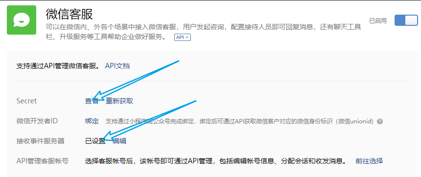
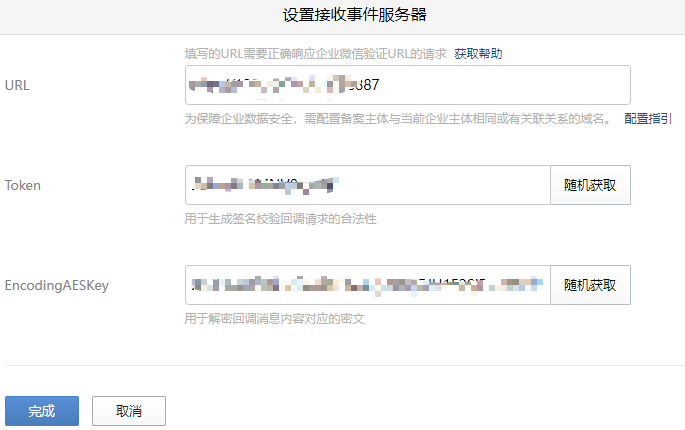
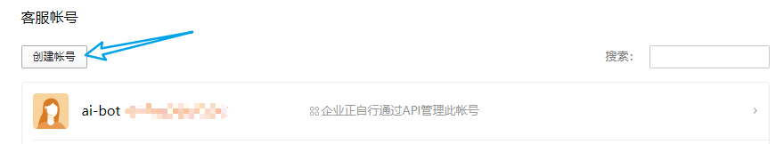
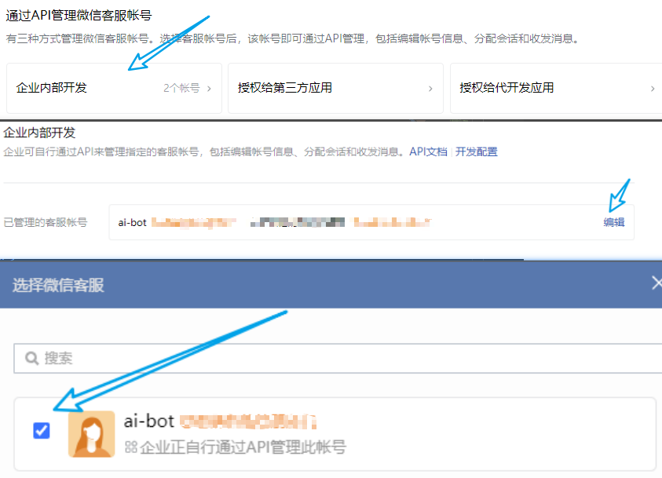

## 本节为对企业微信客服功能配置进行说明（完善中）

[点击企业微信官方配置页面](https://work.weixin.qq.com/wework_admin/frame#/app/servicer)

## 基础配置

### 1.1 获取 secret 


这个 secret 对应 `WeCom.CustomerServiceSecret` 
```yaml
WeCom:                                              # 企业微信配置
  CustomerServiceSecret: "xxxx-xxxx-xxxx"           # 企业微信客服消息 Secret
```
**（感觉是企业微信的设计没有通盘考虑，不应该存在两个 类似 secret 与 token）**

### 1.2 接收事件服务器 设置


这里我复用了配置
```yaml
WeCom:                                              # 企业微信配置
  Token: "xxxxxxxxxx"                               # 企业微信应用/客服消息 Token
  EncodingAESKey: "xxxxxxxxxxxxxxxx"                # 企业微信应用/客服消息 EncodingAESKey
```
对应的URL 就是 `http://{host}:8887` 我们创建应用时候的 url

### 1.3 创建账号

随便填填

滚动到最下方


自此，最基础的配置就完成了

### 1.4 我们可以做什么？

最基础的，可以通过扫码/链接的形式，在微信体系内接入 gpt 客服

## 进阶配置


## 下一步的开发计划

- 私有化知识库