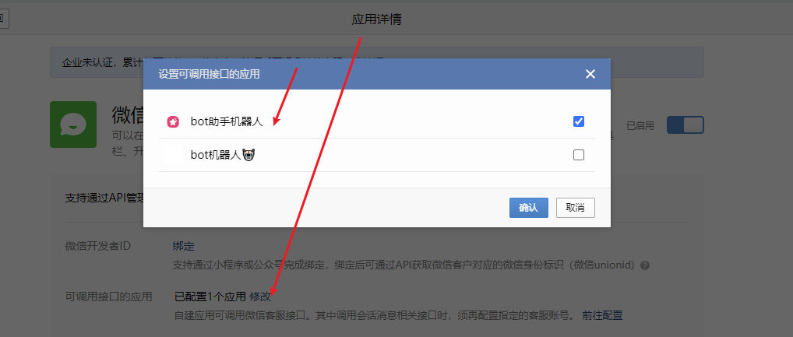
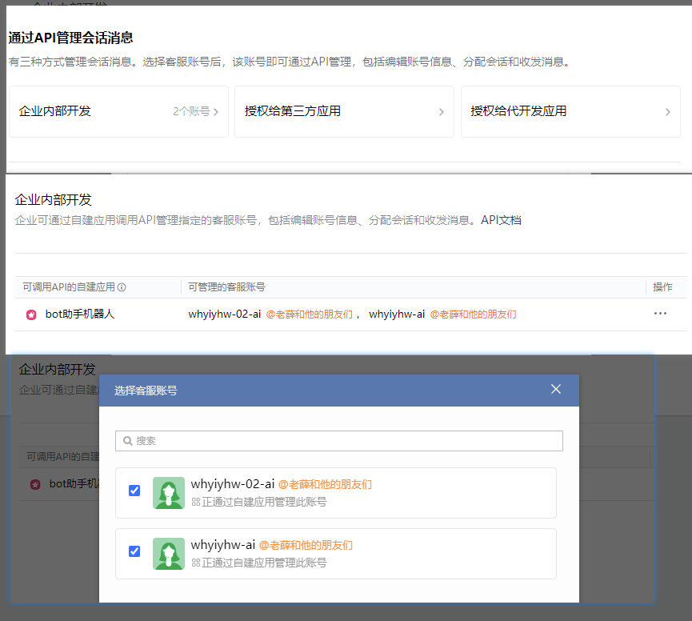

## 本节为对企业微信客服功能配置进行说明（完善中）

[点击企业微信官方配置页面](https://work.weixin.qq.com/wework_admin/frame#/app/servicer)

- 官方开发者问答文档 [点击这里](https://developer.work.weixin.qq.com/community/question/detail?content_id=16545017483768547791)
- https://developer.work.weixin.qq.com/document/path/94677#%E6%8E%A5%E5%8F%A3%E5%AE%9A%E4%B9%89
## 基础配置

### 1.1 设置 可调用接口的应用


在对应的 AgentID 下开启 `WeCom.MultipleApplication.ManageAllKFSession` 让 应用 可以管理所有的客服会话
```yaml
WeCom:                                              # 企业微信配置
  MultipleApplication:
    - AgentID: 1000002                              # 企业微信客服消息 agent
      ManageAllKFSession: true                      # 是否管理所有客服会话
```
~~（感觉是企业微信的设计没有通盘考虑，不应该存在两个 类似 secret 与 token）~~ 一语成真，好家伙真的就改版了呗

### 1.2 创建账号

随便填填

滚动到最下方

自此，最基础的配置就完成了

### 1.4 我们可以做什么？

最基础的，可以通过扫码/链接的形式，在微信体系内接入 gpt 客服

## 进阶配置


## 下一步的开发计划

- 私有化知识库