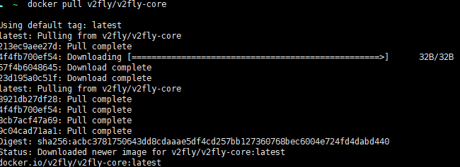
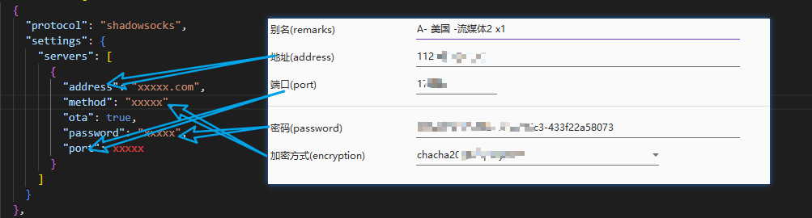
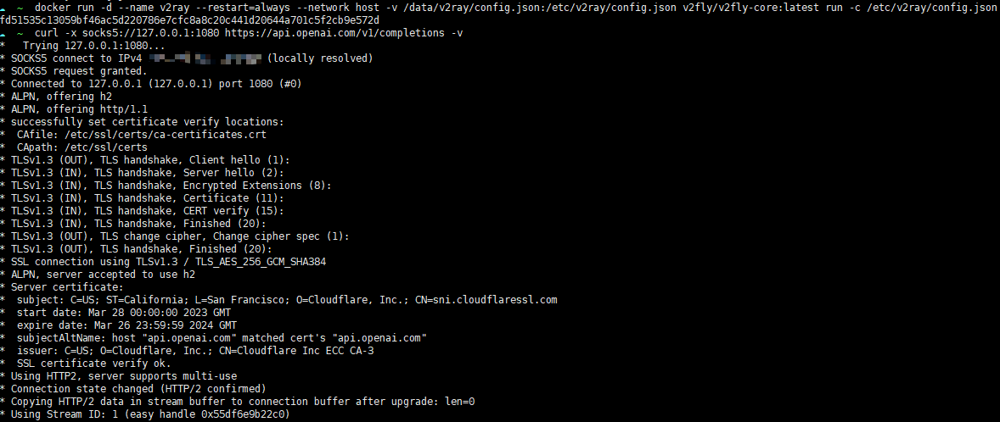

# 待完善

## [点击购买](https://www.v2cloud.xyz/#/register?code=eOTBjF6g) 相关服务

- 购买后可以拿到一个订阅链接
- 已经有了的，直接拿来用就行

## docker 安装 v2ray
```shell
docker pull v2fly/v2fly-core:v5.2.1
```


```shell
mkdir -p /data/v2ray

# 这里参考基础配置文件
vim /data/v2ray/config.json
```

## 基础配置文件 config

详细协议参数及其修改请参考官网 [https://www.v2fly.org/](https://www.v2fly.org/)

### ss 协议
```json
{
  "inbounds": [
    {
      "port": 1080,
      "listen": "0.0.0.0",
      "protocol": "http",
      "sniffing": {
        "enabled": true,
        "destOverride": [
          "http",
          "tls"
        ]
      },
      "settings": {
        "udp": true,
        "auth": "noauth"
      }
    }
  ],
  "outbounds": [
    {
      "protocol": "shadowsocks",
      "settings": {
        "servers": [
          {
            "address": "x.x.x.x",
            "method": "xxx-xxx-xxx",
            "ota": true,
            "password": "xxxxxxxxxxxxxxxxx",
            "port": xxxxx
          }
        ]
      }
    },
    {
      "tag": "direct",
      "settings": {},
      "protocol": "freedom"
    }
  ],
  "dns": {
    "server": [
      "8.8.8.8",
      "1.1.1.1"
    ],
    "clientIp": "xxxx.xxx.xxx.xxx"
  },
  "routing": {
    "domainStrategy": "IPOnDemand",
    "rules": []
  }
}
```

### vmess 协议
```json
{
  "inbounds": [
    {
      "port": 1080,
      "listen": "0.0.0.0",
      "protocol": "socks",
      "sniffing": {
        "enabled": true,
        "destOverride": [
          "http",
          "tls"
        ]
      },
      "settings": {
        "udp": true,
        "auth": "noauth"
      }
    }
  ],
  "outbounds": [
    {
      "protocol": "vmess",
      "settings": {
        "vnext": [
          {
            "address": "x.x.x.x",
            "port": 0,
            "users": [
              {
                "id": "xxxxxxxxxxxxxxxxxxxxxx",
                "alterId": 0
              }
            ]
          }
        ]
      }
    },
    {
      "tag": "direct",
      "settings": {},
      "protocol": "freedom"
    }
  ],
  "dns": {
    "server": [
      "8.8.8.8",
      "1.1.1.1"
    ],
    "clientIp": "xxxx.xxx.xxx.xxx"
  },
  "routing": {
    "domainStrategy": "IPOnDemand",
    "rules": []
  }
}
```
可以自行修改 对应参数
### ss 协议需要修改的点 都用 `xxx` 标明了
```json
  "outbounds": [
    {
      "protocol": "shadowsocks",
      "settings": {
        "servers": [
          {
            "address": "xxxxx.com",
            "method": "xxxxx",
            "ota": true,
            "password": "xxxxx",
            "port": xxxxx
          }
        ]
      }
    },
  ],
  "dns": {
    "clientIp": "xx.xx.xx.xx"
  },
```


- **clientIp 就是你服务器的出口 ip**

### 配置后运行 

```shell
sudo docker run -d --name v2ray --restart=always --network host -v /data/v2ray/config.json:/etc/v2ray/config.json v2fly/v2fly-core:v5.2.1 run -c /etc/v2ray/config.json
```

### 测试是否成功

```shell
curl -x socks5://127.0.0.1:1080 https://api.openai.com/v1/completions -v
```



## 通过脚本，订阅链接，定时自动更新配置，来保证节点的可用性

[相关脚本](https://github.com/whyiyhw/my_tools/blob/main/auto_change_proxy/proxy.php)

```crontab
* * * * * php /path/to/proxy.php >> /dev/null 2>&1
```